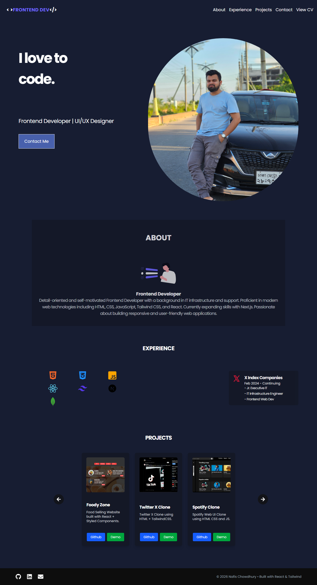

# Abdullah Nafis Chowdhury - Professional Portfolio

A personal portfolio website built with **React.js** to showcase my journey, technical expertise, and the projects I’ve brought to life.

[Link to Live Demo]([https://your-portfolio-link.com](https://my-portfolio-sigma-eight-67.vercel.app/))

---

## 🌟 Overview
This project serves as my digital business card. It’s a single-page application (SPA) designed to provide a seamless user experience while highlighting my career trajectory and skill set.

### Key Sections:
* **Hero Section:** A brief introduction and my value proposition.
* **Projects Gallery:** A curated list of my best work with links to GitHub and live demos.
* **Career Timeline:** A breakdown of my professional experience and education.
* **Skills:** A visual representation of my tech stack.
* **CV/Resume:** A downloadable version of my professional resume.
* **Contact:** An integrated form/social links for networking.

## 🛠 Tech Stack
* **Frontend:** React.js (Hooks, Functional Components)
* **Styling:** [e.g., Tailwind CSS / Styled Components / CSS Modules]
* **Animations:** [e.g., Framer Motion]
* **Deployment:** [e.g., Vercel / GitHub Pages]

## 📸 Screenshots
| Desktop View |

|  | 

## 🚀 Installation & Setup
To run this project locally, follow these steps:

1. **Clone the repository:**
   ```bash
   git clone [https://github.com/yourusername/portfolio-repo.git](https://github.com/yourusername/portfolio-repo.git)](https://github.com/A-Nafis-Ch/MY_PORTFOLIO.git)
